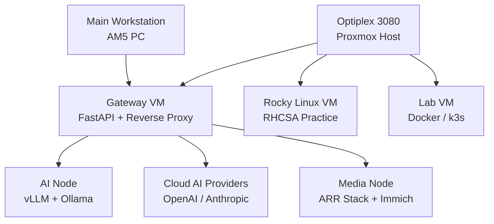

Tags: [[0 - Overview]] [[0 - HomeLab]] [[Networking-Computer]]

# 2026 Homelab Architecture

This environment is organized as a layered system rather than a collection of loosely related hosts. Each node has a defined responsibility, which keeps operational boundaries clear and makes the lab easier to expand without creating unnecessary coupling.

## Node Layout

### AI Node

**Role:** GPU inference workloads

**Operating system:** Ubuntu Server 24.04 on bare metal

**Services:**

- `vLLM` on `8000`
- `Ollama` on `11434`
- `ComfyUI` planned for future image workflows

### Optiplex 3080

**Role:** Control plane, orchestration, and lab environments

**Operating system:** Proxmox

#### Gateway VM

**Role:** API gateway and orchestration layer

**Services:**

- FastAPI for request routing
- Nginx or Caddy for reverse proxying
- Logging and metrics

**Ports:**

- `80/443` public entry
- `8080` internal FastAPI service

#### Rocky Linux VM

**Role:** RHCSA practice environment

**Focus areas:**

- `systemd`
- SELinux
- storage and LVM
- networking
- users and groups

#### Lab VM

**Role:** Temporary experiments

- Docker testing
- k3s evaluation
- throwaway workloads

### Media and Storage Node

**Role:** Media, storage, and download automation

**Operating system:** Ubuntu Server 24.04 on bare metal

**Services:**

- Jellyfin on `8096`
- Sonarr on `8989`
- Radarr on `7878`
- Prowlarr on `9696`
- qBittorrent on `8081`
- Immich on `2283`

**Storage paths:**

- `/mnt/media`
- `/mnt/downloads`
- `/mnt/photos`

## IP Scheme

| Device       | Hostname     | IP             |
| ------------ | ------------ | -------------- |
| Router       | `gateway`    | `192.168.1.1`  |
| AI Node      | `ai-node`    | `192.168.1.7`  |
| Proxmox Host | `proxmox`    | `192.168.1.8`  |
| Gateway VM   | `ai-gateway` | `192.168.1.20` |
| Rocky VM     | `rocky-lab`  | `192.168.1.21` |
| Media Node   | `media-node` | `192.168.1.9`  |

## Request Flow

1. A client sends a request to `ai-gateway`.
2. The gateway decides whether the request should stay local or use a cloud model.
3. Local inference routes to `ai-node` through `vLLM`.
4. Cloud requests route to external APIs such as OpenAI or Anthropic.
5. Logging and metrics stay at the gateway layer for visibility and control.
6. Media and storage workloads are served from the media node, including NFS-backed access where needed.

## Mermaid Diagram

## Anti-Patterns

- Mixing AI and media workloads on the same node
- Treating stable systems as experiment boxes
- Adding orchestration layers before they solve a real problem
- Letting convenience override separation of concerns
