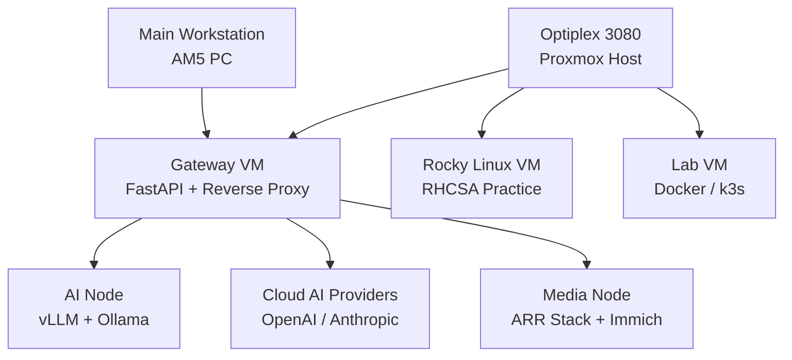

# 2026 Homelab Infrastructure

Layered homelab platform for local AI inference, media automation, storage, platform engineering practice, and a long-term path toward MLOps engineering.

## Overview

This project documents a 2026 homelab built around operational separation of concerns.

The environment is split into four layers:

- Compute for GPU-backed inference
- Control for routing and orchestration
- Data for media, downloads, and storage
- Interface for operator access and development

The goal is to keep stable services reliable while preserving room for experimentation. It is also the environment I am using to learn the operational side of AI systems, including local model serving, request routing, and the infrastructure patterns that lead toward MLOps work.

## Architecture

### AI Node

Dedicated GPU compute host for model serving.

- Platform: AM4
- GPU: RTX 4070 Ti Super, 16 GB VRAM
- RAM target: 64 GB
- OS: Ubuntu Server 24.04
- Services:
  - `vLLM`
  - `Ollama`
  - `ComfyUI` planned
- Ports:
  - `8000` for `vLLM`
  - `11434` for `Ollama`

### Control and Lab Node

Optiplex 3080 SFF running Proxmox.

- CPU: Intel i5
- RAM target: 32 to 64 GB
- OS: Proxmox

VMs:

- Gateway VM
  - FastAPI request routing
  - Nginx or Caddy reverse proxy
  - logging and metrics
  - ports `80/443` and `8080`
- Rocky Linux VM
  - RHCSA practice
  - SELinux, `systemd`, storage, networking, users and groups
- Lab VM
  - Docker testing
  - k3s evaluation
  - temporary workloads

### Media and Storage Node

Stable media and storage host.

- Hardware: HP Elitedesk G4
- RAM target: 16 to 32 GB
- Storage:
  - `2 x 4 TB` HDD for media
  - `256 GB` NVMe for OS
- OS: Ubuntu Server 24.04
- Services:
  - Jellyfin
  - Sonarr
  - Radarr
  - Prowlarr
  - qBittorrent
  - Immich

Ports:

- `8096` Jellyfin
- `8989` Sonarr
- `7878` Radarr
- `9696` Prowlarr
- `8081` qBittorrent
- `2283` Immich

Storage paths:

- `/mnt/media`
- `/mnt/downloads`
- `/mnt/photos`

### Main Workstation

Primary operator interface into the environment.

- Platform: AM5
- GPU: RX 7800 XT or equivalent
- OS: Windows with optional dual boot
- Usage:
  - SSH
  - VS Code
  - Parsec
  - gaming

## Network

### IP Scheme

| Device       | Hostname     | IP             |
| ------------ | ------------ | -------------- |
| Router       | `gateway`    | `192.168.1.1`  |
| AI Node      | `ai-node`    | `192.168.1.7`  |
| Proxmox Host | `proxmox`    | `192.168.1.8`  |
| Gateway VM   | `ai-gateway` | `192.168.1.20` |
| Rocky VM     | `rocky-lab`  | `192.168.1.21` |
| Media Node   | `media-node` | `192.168.1.9`  |

### Request Flow

1. Client traffic enters through `ai-gateway`.
2. The gateway decides between local inference and cloud fallback.
3. Local requests route to the AI node through `vLLM`.
4. Cloud requests route to providers such as OpenAI or Anthropic.
5. Logging and metrics remain centralized at the gateway layer.
6. Media and storage workloads remain isolated on the media node.

## Tech Stack

- Proxmox for virtualization
- Ubuntu Server 24.04 for bare-metal Linux hosts
- Rocky Linux for RHCSA practice
- FastAPI for request routing
- Nginx or Caddy for reverse proxying
- `vLLM` and Ollama for local AI serving
- Jellyfin, Sonarr, Radarr, Prowlarr, qBittorrent, and Immich for media services
- NFS-backed shared storage where appropriate

## Current Status

### Completed

- Ubuntu installed on the AI node
- NVIDIA drivers working

### In Progress

- Proxmox deployment on the Optiplex
- Ubuntu deployment on the Elitedesk

### Planned

- `vLLM` deployment
- FastAPI gateway
- ARR stack deployment
- Immich deployment
- Cloud fallback routing
- Logging and metrics

## Design Principles

- One machine, one role
- Local-first AI with cloud fallback
- Stable systems stay stable
- Complexity must justify itself

## Future Improvements

- k3s cluster evaluation
- Monitoring stack
- CI/CD pipelines
- Auth and rate limiting
- Tailscale for external access

## What This Project Demonstrates

- Infrastructure design with clear operational boundaries
- GPU-backed local model serving
- Hybrid local and cloud inference routing
- Hands-on progress toward MLOps through model-serving infrastructure
- Separation of stable services from experimental systems
- Practical systems design beyond single-host container deployment
