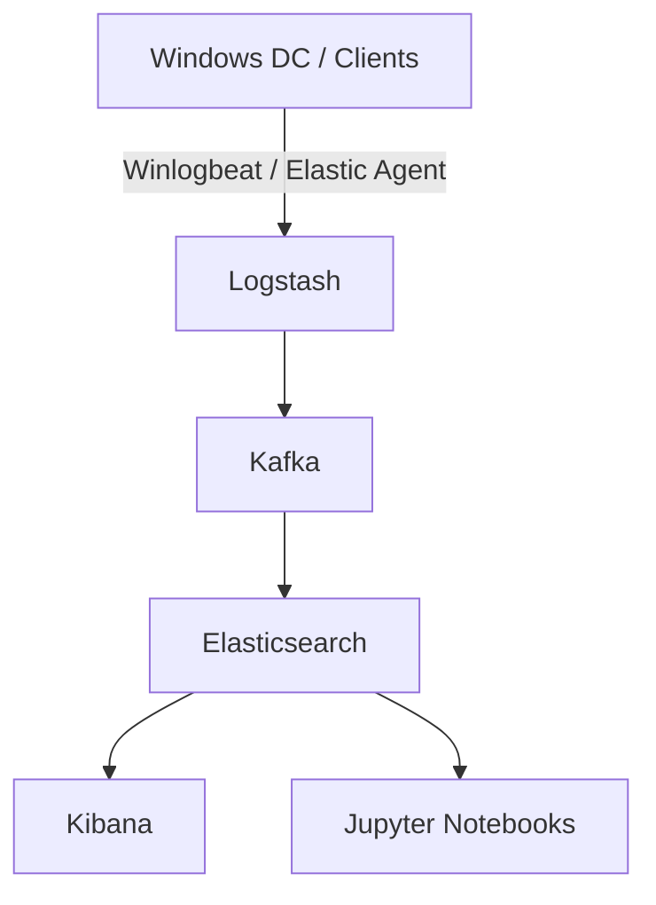

# HELK Project

## Overview
The **Hunting ELK (HELK)** project is my detection engineering and threat hunting lab environment.  
It integrates:
- **Elasticsearch, Logstash, Kibana**
- **Kafka**
- **Jupyter notebooks**
- **Sigma rules**
- **Winlogbeat/Elastic Agent ingestion**

Purpose:  
- Build a centralized detection & hunting platform.  
- Test adversary emulation (Atomic Red Team, custom PowerShell scripts, etc.).  
- Develop custom detections (KQL, Sigma, Splunk → Elastic translations).  

---

## Architecture

## Setup Steps

### 1. Infrastructure

- Base: Proxmox VM lab
    
- Networking: UniFi UCG-Fiber + Aruba 6100 VLANs
    
- HELK VM specs:
    
    - CPU: 4
        
    - RAM: 8–16GB
        
    - Storage: 100GB+
        

### 2. HELK Installation

 Clone HELK repo:
 git clone https://github.com/Cyb3rWard0g/HELK.git
cd HELK/docker
sudo ./helk_install.sh

