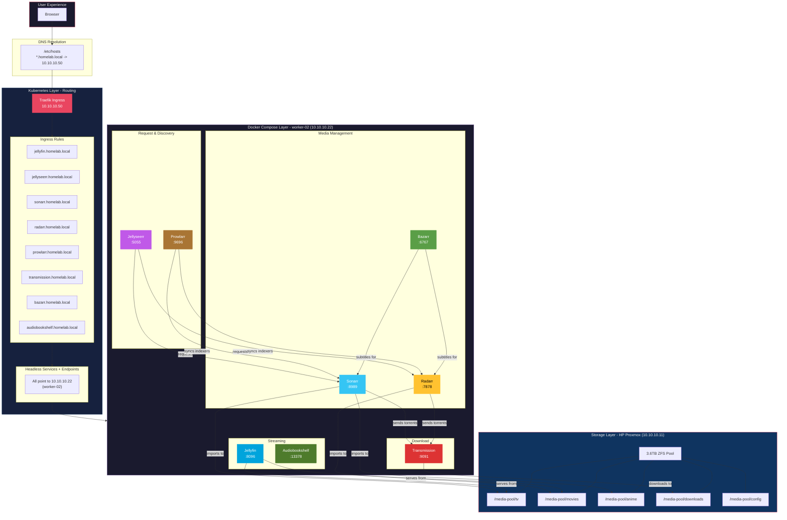
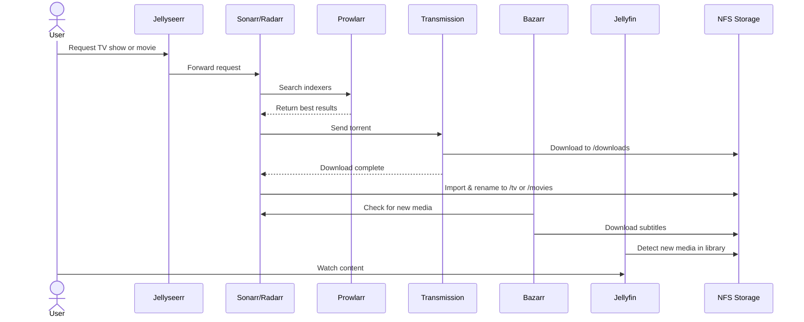
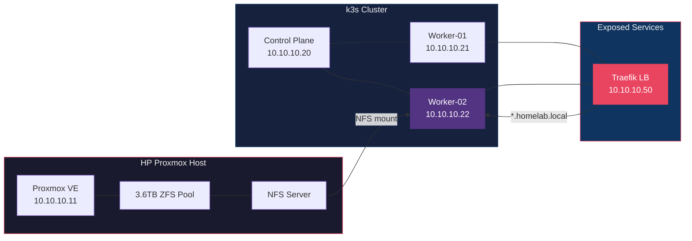

Tags: [[0 - HomeLab]] [[4 - Media Stack/0 - Overview|Media Stack]]

# Media Stack Architecture Diagram

## Full System Architecture

```mermaid
graph TB
    subgraph USER["User Experience"]
        Browser["Browser"]
    end

    subgraph DNS["DNS Resolution"]
        Hosts["/etc/hosts<br>*.homelab.local -> 10.10.10.50"]
    end

    subgraph K8S["Kubernetes Layer - Routing"]
        Traefik["Traefik Ingress<br>10.10.10.50"]
        subgraph Ingress["Ingress Rules"]
            I1["jellyfin.homelab.local"]
            I2["jellyseerr.homelab.local"]
            I3["sonarr.homelab.local"]
            I4["radarr.homelab.local"]
            I5["prowlarr.homelab.local"]
            I6["transmission.homelab.local"]
            I7["bazarr.homelab.local"]
            I8["audiobookshelf.homelab.local"]
        end
        subgraph SvcEp["Headless Services + Endpoints"]
            EP["All point to 10.10.10.22<br>(worker-02)"]
        end
    end

    subgraph DOCKER["Docker Compose Layer - worker-02 (10.10.10.22)"]
        subgraph Request["Request & Discovery"]
            Jellyseerr["Jellyseerr<br>:5055"]
            Prowlarr["Prowlarr<br>:9696"]
        end
        subgraph Management["Media Management"]
            Sonarr["Sonarr<br>:8989"]
            Radarr["Radarr<br>:7878"]
            Bazarr["Bazarr<br>:6767"]
        end
        subgraph Download["Download"]
            Transmission["Transmission<br>:9091"]
        end
        subgraph Streaming["Streaming"]
            Jellyfin["Jellyfin<br>:8096"]
            Audiobookshelf["Audiobookshelf<br>:13378"]
        end
    end

    subgraph NFS["Storage Layer - HP Proxmox (10.10.10.11)"]
        ZFS["3.6TB ZFS Pool"]
        TV["/media-pool/tv"]
        Movies["/media-pool/movies"]
        Anime["/media-pool/anime"]
        DL["/media-pool/downloads"]
        Config["/media-pool/config"]
    end

    Browser --> Hosts
    Hosts --> Traefik
    Traefik --> Ingress
    Ingress --> SvcEp
    SvcEp --> DOCKER

    Jellyseerr -->|"requests"| Sonarr
    Jellyseerr -->|"requests"| Radarr
    Prowlarr -->|"syncs indexers"| Sonarr
    Prowlarr -->|"syncs indexers"| Radarr
    Sonarr -->|"sends torrents"| Transmission
    Radarr -->|"sends torrents"| Transmission
    Sonarr -->|"imports to"| TV
    Sonarr -->|"imports to"| Anime
    Radarr -->|"imports to"| Movies
    Transmission -->|"downloads to"| DL
    Bazarr -->|"subtitles for"| Sonarr
    Bazarr -->|"subtitles for"| Radarr
    Jellyfin -->|"serves from"| TV
    Jellyfin -->|"serves from"| Movies

    ZFS --- TV
    ZFS --- Movies
    ZFS --- Anime
    ZFS --- DL
    ZFS --- Config

    style USER fill:#1a1a2e,stroke:#e94560,color:#eee
    style K8S fill:#16213e,stroke:#0f3460,color:#eee
    style DOCKER fill:#1a1a2e,stroke:#533483,color:#eee
    style NFS fill:#0f3460,stroke:#e94560,color:#eee
    style Traefik fill:#e94560,stroke:#e94560,color:#fff
    style Jellyfin fill:#00a4dc,stroke:#00a4dc,color:#fff
    style Jellyseerr fill:#c059e8,stroke:#c059e8,color:#fff
    style Sonarr fill:#35c5f4,stroke:#35c5f4,color:#fff
    style Radarr fill:#ffc230,stroke:#ffc230,color:#000
    style Prowlarr fill:#a97534,stroke:#a97534,color:#fff
    style Transmission fill:#d33,stroke:#d33,color:#fff
    style Bazarr fill:#5a9e47,stroke:#5a9e47,color:#fff
    style Audiobookshelf fill:#4e7b2b,stroke:#4e7b2b,color:#fff
```

## Request-to-Playback Flow

```mermaid
sequenceDiagram
    actor User
    participant JS as Jellyseerr
    participant Sonarr as Sonarr/Radarr
    participant P as Prowlarr
    participant T as Transmission
    participant B as Bazarr
    participant JF as Jellyfin
    participant NFS as NFS Storage

    User->>JS: Request TV show or movie
    JS->>Sonarr: Forward request

    Sonarr->>P: Search indexers
    P-->>Sonarr: Return best results

    Sonarr->>T: Send torrent
    T->>NFS: Download to /downloads

    T-->>Sonarr: Download complete
    Sonarr->>NFS: Import & rename to /tv or /movies

    B->>Sonarr: Check for new media
    B->>NFS: Download subtitles

    JF->>NFS: Detect new media in library
    User->>JF: Watch content
```

## Network Topology

```mermaid
graph LR
    subgraph Proxmox["HP Proxmox Host"]
        PVE["Proxmox VE<br>10.10.10.11"]
        ZFS["3.6TB ZFS Pool"]
        NFSS["NFS Server"]
    end

    subgraph K3S["k3s Cluster"]
        CP["Control Plane<br>10.10.10.20"]
        W1["Worker-01<br>10.10.10.21"]
        W2["Worker-02<br>10.10.10.22"]
    end

    subgraph Services["Exposed Services"]
        TF["Traefik LB<br>10.10.10.50"]
    end

    PVE --- ZFS
    ZFS --- NFSS
    NFSS -->|"NFS mount"| W2
    CP --- W1
    CP --- W2
    W1 --- TF
    W2 --- TF
    TF -->|"*.homelab.local"| W2

    style Proxmox fill:#1a1a2e,stroke:#e94560,color:#eee
    style K3S fill:#16213e,stroke:#0f3460,color:#eee
    style Services fill:#0f3460,stroke:#e94560,color:#eee
    style TF fill:#e94560,stroke:#e94560,color:#fff
    style W2 fill:#533483,stroke:#533483,color:#fff
```
